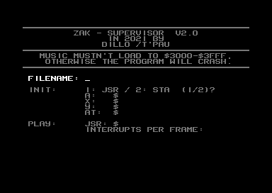

# Zak Supervisor

## Play and monitor music on your C64.

This tool helps you find the right addresses to monitor for equalizers and other effects synced to the music. It works with any music that can be played by calling a subroutine. It supports one to four calls per frame.

`ZAK SUPERVISOR` can be started with `RUN`. If the music you are trying to monitor is already in memory (e. g. after a reset when running the program containing the music), you can load `ZAK S. SYS 12800` to avoid overwriting it; start the program with `SYS 12800`.

To restart the program without resetting the monitor positions, use `SYS 12803`.

Zak Supervisor uses the memory from $3000 to $3fff, which means music that also uses that memory range currently can't be monitored with Zak Supervisor.

## Initialization

The first screen lets you load the music from disk and specify how to initialize and play it.

**Filename:** Enter the name of the file to load, or leave empty to skip loading (if the music is already in memory).

**Init:** Specify whether to initialize the music with `STA $xxxx` or with `JSR $xxxx`, and the values of the `A`, `X`, and `Y` registers. Usually the music is initialized with `JSR` to the load address of the music, where `A` selects which song to play.

**Play:** Specify which subroutine to call for playing the music (usually the load address plus three), and how often per frame to call the play routine (usually once).

All values are entered in hexadecimal.

## Playback and Monitoring

The second screen allows you to monitor memory addresses during playback.

The white bars in the border show the amount of time the playback routines use. The scale at the edges of the screen show the used time in height of characters.

The bottom part shows one page (256 bytes) of memory. Use the cursor keys to move the selected byte, `-` and `+` to switch pages, `Shift -` and `Shift +` to switch pages by increments of 16.

The top portion shows the value of the current position and up to eight remembered positions. Set the addresses to monitor with the keys `1` through `8`.

The next section shows the amount of raster time currently used as well as the maximum time used so far.

The three lines in red and white show the value of one memory location over time. Each column in a pair of lines of the same color shows the value after one call to the playback routine. Set the memory location to monitor with the `RETURN` key.

All values are shown in hexadecimal.

## Keyboard Commands

`1`-`8`: Set corresponding address to monitor.

`RETURN`: Set address to monitor in colored lines.

Cursor Keys: Select current address within the current page.

`-`, `+`: Change current page.

`Shift -`, `Shift +`: Change current page by increments of 16.

`Run-Stop`: Reset maximum raster time.

`Shift E`: Exit program.

# Building Zak Supervisor

Zak Supervisor is written in [Accelerate](https://accelerate.tpau.group/) assembler. To build it, you also need, [pucrunch](https://github.com/mist64/pucrunch), GNU make, and Perl. You also need the `c1541` utility from [Vice](http://vice-emu.sourceforge.net).
